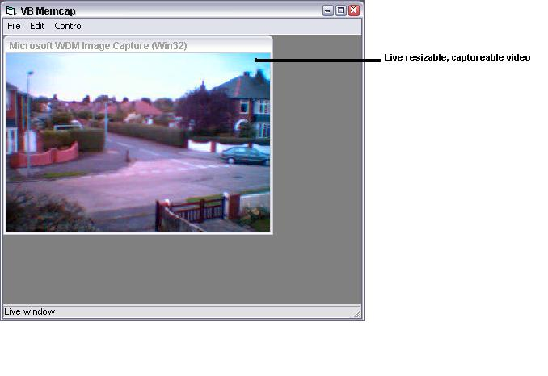



## Capture Video from you Webcam \(the best\)

### Description

Capture motion or still images from your webcam to clipboard / file!

Does not use any extra .dll's or .ocx's!

I DID NOT WRITE THIS CODE

Author: E. J. Bantz Jr.

But its real good so I thought i'd share it!
 
### More Info
 

             |
---                |---
**Submitted On**   |1998-03-18 18:34:18
**By**             |[Chris Wilson UK](https://github.com/Planet-Source-Code/PSCIndex/blob/master/ByAuthor/chris-wilson-uk.md)
**Level**          |Advanced
**User Rating**    |4.8 (171 globes from 36 users)
**Compatibility**  |VB 6\.0
**Category**       |[Complete Applications](https://github.com/Planet-Source-Code/PSCIndex/blob/master/ByCategory/complete-applications__1-27.md)
**World**          |[Visual Basic](https://github.com/Planet-Source-Code/PSCIndex/blob/master/ByWorld/visual-basic.md)
**Archive File**   |[Capture Vi3173810292001\.zip](https://github.com/Planet-Source-Code/chris-wilson-uk-capture-video-from-you-webcam-the-best__1-28493/archive/master.zip)

